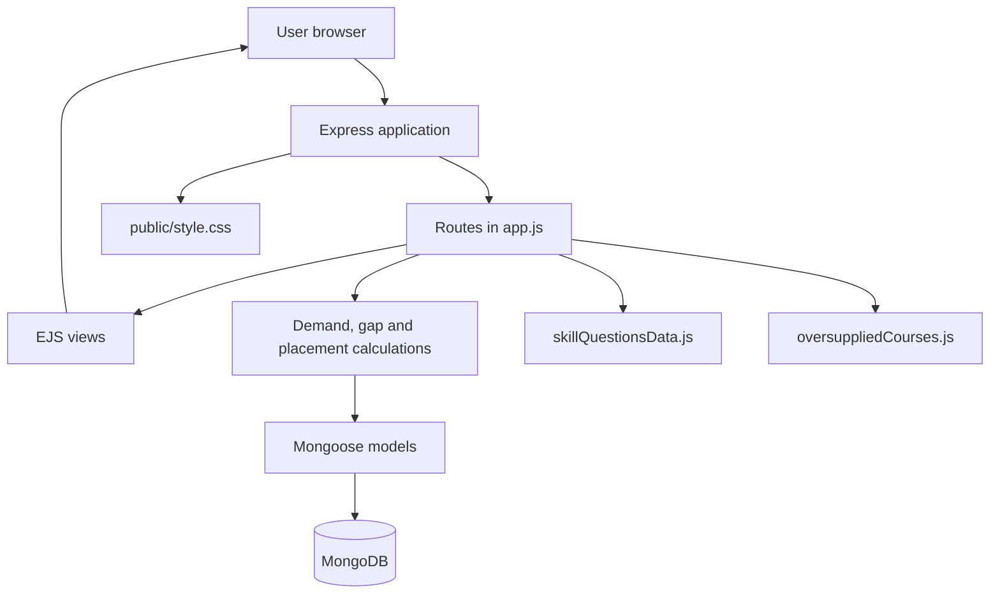

# Skill Intelligence

> A labour-market intelligence platform that compares industry demand with curricula, skill assessments, employer feedback, and placement outcomes.

[](https://opensource.org/licenses/ISC)
[](https://developer.mozilla.org/en-US/docs/Web/JavaScript)
[](https://nodejs.org/)
[](https://expressjs.com/)
[](https://mongoosejs.com/)

## Table of Contents

- [Overview](#overview)
- [Problem Statement](#problem-statement)
- [Features](#features)
- [Technology Stack](#technology-stack)
- [Architecture](#architecture)
- [Installation](#installation)
- [Configuration](#configuration)
- [Usage](#usage)
- [Application Workflow](#application-workflow)
- [Routes](#routes)
- [Folder Structure](#folder-structure)
- [Data Model](#data-model)
- [Testing](#testing)
- [Known Limitations](#known-limitations)
- [License](#license)

## Overview

Skill Intelligence is an Express and MongoDB web application for analysing the relationship between industry job demand, required skills, existing curricula, learner assessments, employer feedback, training plans, and placement outcomes.

The application provides server-rendered dashboards and reports for students, employers, training providers, and programme administrators.

## Problem Description in SIH portal

	
• Problem Description Skill-development programmes may be designed using broad or historical occupation categories that do not fully reflect changing technologies, local industry demand, job roles, productivity standards and employer expectations.Course curricula, equipment, trainer capacity and assessment methods may lag emerging requirements. Employers may struggle to identify job-ready candidates, while trainees may complete courses that have limited placement potential. The challenge is to create a continuous, evidence-based mechanism for translating industry demand into course design, capacity planning, trainer development and candidate guidance.
• Expected Solution / Outcome A labour-market intelligence and curriculum-alignment platform that combines job-posting signals, employer surveys, industry consultations, sector growth data, placement outcomes and emerging-technology trends to identify demand by role, skill, location and proficiency level. The system should map skill gaps to qualifications and courses,recommend curriculum updates, flag obsolete or oversupplied courses,support employer validation and generate district-level training plans. Expected outcomes include stronger placement rates, reduced mismatch, improved employer satisfaction, timely course revision, better equipment and trainer planning, and clearer career pathways for candidates.

## Features

- **Industry skill-demand analysis** — extracts supported skills from job descriptions and calculates demand percentages from stored job postings.
- **Role-wise demand analysis** — groups job postings by role and calculates each role's share of the dataset.
- **District-wise demand analysis** — groups job postings by submitted location and calculates local skill demand.
- **Question-based skill assessment** — provides role-specific questions for five predefined roles and stores the learner's selected skills.
- **Skill-gap analysis** — compares industry-demand skills with the current curriculum or learner profile.
- **Prioritised recommendations** — assigns `High`, `Medium`, or `Low` priority and maps missing skills to recommendations.
- **Employer validation** — captures employer, role, skill, proficiency, and feedback information and compares it with identified gaps.
- **District training planning** — generates skills-to-train, trainer requirements, equipment requirements, and an overall training priority.
- **Placement outcome tracking** — records trained, completed, and placed students, average salary, skills used, and employer satisfaction.
- **Placement effectiveness analysis** — checks whether recommended skills are used in recorded placements.
- **Oversupplied-course intelligence** — displays curated oversupplied courses with alternative learning paths and industry skills.
- **Server-rendered dashboard** — uses EJS templates, EJS-Mate layouts, Bootstrap, Bootstrap Icons, Chart.js, and custom CSS.

Priority thresholds are implemented in `app.js` as follows: `High` for demand of at least 60%, `Medium` for demand of at least 40%, and `Low` below 40%.

## Technology Stack

| Area | Technology |
|---|---|
| Runtime | Node.js |
| Language | JavaScript |
| Module system | CommonJS |
| Web framework | Express `5.2.1` |
| Templating | EJS `6.0.1` |
| Layouts | EJS-Mate `4.0.0` |
| Database | MongoDB |
| ODM | Mongoose `9.9.4` |
| Environment configuration | dotenv `17.4.2` |
| Frontend styling | Bootstrap `5.3.8` and custom CSS |
| Icons | Bootstrap Icons `1.11.3` |
| Charts | Chart.js `4.4.3` |
| Package manager | npm |

The repository does not define a Node.js version in `package.json`.

## Architecture

`app.js` contains the Express server, routes, database connection, and application calculations. Mongoose models define MongoDB documents, EJS templates render pages, and local data files provide assessment questions and oversupplied-course content.



## Installation

### Prerequisites

- Node.js and npm
- MongoDB, either locally or through a hosted deployment

### Install and configure

```bash
git clone https://github.com/shubhamsheelvant88/SIH-SKILL-INTELLIGENCE.git
cd SIH-SKILL-INTELLIGENCE
npm install
```

The repository also defines `npm run setup`, which runs `npm install`.

Create a `.env` file in the project root:

```env
MONGO_URI=mongodb://127.0.0.1:27017/skill-intelligence
```

### Start the application

```bash
npm start
```

For development with Node's file watcher:

```bash
npm run dev
```

The server listens on port `8080`:

```text
http://localhost:8080
```

## Configuration

The application loads environment variables with `dotenv`.

| Variable | Description | Example |
|---|---|---|
| `MONGO_URI` | MongoDB connection string used by `app.js` and optionally by `init.js` | `mongodb://127.0.0.1:27017/skill-intelligence` |

`.env` is excluded from version control by `.gitignore`. `app.js` reads `MONGO_URI` directly, so configure it before starting the application. `init.js` falls back to the local MongoDB URI shown above when `MONGO_URI` is not set.

The application currently uses a fixed port of `8080`; no `PORT` environment variable is implemented.

## Usage

### Open the dashboard

After starting the server, open:

```text
http://localhost:8080/dashboard
```

The landing page is available at `/` and `/home`.

### Add a job posting

Open:

```text
http://localhost:8080/job-posting
```

Submit a company, role, location, and description. The current deterministic extractor checks for these supported skills:

```text
JavaScript, React, Node.js, MongoDB, AWS, Docker,
TypeScript, HTML, CSS, Python, Java, C++, SQL, Git, Express
```

The extracted skills are stored with the posting and used in demand calculations.

### Run a learner assessment

Open:

```text
http://localhost:8080/analyze-skill-gaps
```

Select a role and complete the assessment. On submission, the selected skills and role demand values are saved to MongoDB and the application redirects to the skill-gap report.

Related reports:

```text
http://localhost:8080/skill-gap
http://localhost:8080/recommendations
http://localhost:8080/validated-gap
```

### Seed sample curriculum data

`init.js` deletes existing `SkillDemand` documents and inserts a sample Bengaluru full-stack development record:

```bash
node init.js
```

> Run this only when replacing the current skill-demand dataset is intentional.

## Application Workflow


## Routes

### General and demand analysis

| Method | Route | Purpose |
|---|---|---|
| `GET` | `/` or `/home` | Render the landing page |
| `GET` | `/dashboard` | Render the main dashboard |
| `GET` | `/skills` | Display stored skill-demand data |
| `GET` | `/industry-demand` | Calculate overall skill demand |
| `GET` | `/live-analysis` | Calculate current demand and curriculum gaps |
| `GET` | `/district-demand` | Calculate demand grouped by location |
| `GET` | `/role-demand` | Calculate demand grouped by role |

### Skill gaps, jobs, and employers

| Method | Route | Purpose |
|---|---|---|
| `GET` | `/analyze-skill-gaps` | Select an assessment role |
| `GET` | `/analyze-skill-gaps/assessment` | Display role-specific questions |
| `POST` | `/analyze-skill-gaps/submit` | Store assessment results |
| `GET` | `/skill-gap` | Display skill gaps |
| `GET` | `/recommendations` | Display recommendations |
| `GET` | `/job-posting` | Display the job-posting form |
| `POST` | `/job-posting` | Extract and save a job posting |
| `GET` | `/job-postings` | List stored job postings |
| `GET` | `/employer-feedback` | Display the employer-feedback form |
| `POST` | `/employer-feedback` | Store employer feedback |
| `GET` | `/employers` | List employer feedback |
| `GET` | `/validated-gap` | Compare gaps with employer feedback |

### Training and placement

| Method | Route | Purpose |
|---|---|---|
| `GET` | `/district-plan` | Generate a district training plan |
| `GET` | `/placement-outcome` | Display the placement-outcome form |
| `POST` | `/placement-outcome` | Store a placement outcome |
| `GET` | `/placement-outcomes` | List outcomes and placement rates |
| `GET` | `/placement-effectiveness` | Analyse skill usage in placements |
| `GET` | `/oversupplied-courses` | Display oversupplied-course recommendations |

## Folder Structure

```text
SIH-SKILL-INTELLIGENCE/
├── app.js                         # Express server, routes and calculations
├── init.js                         # Optional sample-data initialization
├── data/
│   ├── oversuppliedCourses.js      # Oversupplied courses and alternatives
│   └── skillQuestionsData.js       # Role questions and recommendations
├── models/
│   ├── EmployerFeedback.js         # Employer feedback schema
│   ├── jobPosting.js               # Job-posting schema
│   ├── placementOutcome.js         # Placement outcome schema
│   └── skillDemand.js              # Curriculum and demand schema
├── public/
│   └── style.css                   # Application styles
├── views/
│   ├── layouts/
│   │   └── boilerplate.ejs         # Shared layout and navigation
│   └── *.ejs                       # Dashboard, form and report templates
├── .gitignore                      # Excludes .env
├── package.json                    # Dependencies and npm scripts
├── package-lock.json               # Locked dependency versions
└── updates.md                      # Project update notes
```

`node_modules/` is dependency output and is not application source.

## Data Model

### `SkillDemand`

`district`, `sector`, `course`, `industryDemand` (mixed object), and `currentCurriculum` (array of strings).

### `JobPosting`

`company`, `role`, `location`, `description`, `extractedSkills`, and `createdAt`.

### `EmployerFeedback`

`company`, `role`, `skills` (objects containing `skill` and `proficiency`), `feedback`, and `createdAt`.

### `PlacementOutcome`

`district`, `course`, `studentsTrained`, `studentsCompleted`, `studentsPlaced`, optional `averageSalary`, `skillsUsed`, optional `employerSatisfaction` from 1 to 5, and `createdAt`.

## Testing

The repository does not currently contain an application test suite or test directory. The configured test script is a placeholder:

```bash
npm test
```

It exits with:

```text
Error: no test specified
```

No test framework or CI workflow is configured for this application.

## Known Limitations

- Job postings are entered manually; external job-board APIs are not integrated.
- Skill extraction uses case-insensitive substring matching against a fixed skill list.
- Demand percentages are based only on stored job postings, not a live labour-market feed.
- There is no authentication or role-based access control.
- Assessment submission deletes all existing `SkillDemand` documents before saving the new profile.
- Oversupplied-course data is curated locally rather than calculated from capacity, demand, and placement datasets.
- The repository does not define a Node.js `engines` constraint.

## License

This project is licensed under the ISC License, as declared in `package.json`.
